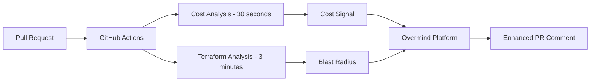

<div align="center">
  <picture>
    <source media="(prefers-color-scheme: dark)" srcset="https://assets-global.website-files.com/6241e92445c21f9c1245a940/6582c2b96d741b023f1afabf_ov-lite-icon-p-500.png">
    
  </picture>

  # Overmind Cost Signals Action

  <p>
    <a href="https://overmind.tech">https://overmind.tech</a>
  </p>
  
  <p>
    Analyze infrastructure cost changes with Infracost and submit them as Overmind Custom Signals for enhanced financial risk visibility - all in parallel with your terraform analysis.
  </p>
<br/>
<p align="center">
  <a href="https://discord.com/invite/5UKsqAkPWG" rel="nofollow"></a>
</p>
<p align="center">
  <a href="https://www.youtube.com/watch?v=cr4Q0oLaANk&t=7s">Watch a demo</a> | <a href="https://docs.overmind.tech/getting-started/overview">Documentation</a> | <a href="https://app.overmind.tech/api/auth/signup">Sign up</a> | <a href="https://www.linkedin.com/company/overmindtech/">Follow us</a>
</p>
<br/>
## Quick Start

Add cost analysis to your Overmind workflow in under 2 minutes. This action runs Infracost on your terraform plans and submits cost changes as "Cost" signals, giving you immediate financial context while terraform analysis runs in parallel.

```yaml
- uses: overmindtech/cost-signals-action@v1
  with:
    overmind-api-key: ${{ secrets.OVM_API_KEY }}
    infracost-api-key: ${{ secrets.INFRACOST_API_KEY }}
```

## What This Does

This GitHub Action enhances your Overmind change analysis by:

1. **Analyzing cost impact** immediately when a PR is created/updated
2. **Submitting cost changes** as Custom Signals to Overmind (in parallel with terraform analysis)
3. **Providing instant financial context** on infrastructure changes (typically within 30 seconds)
4. **Enriching the PR comment** with cost data alongside blast radius analysis

## How Cost Signals Work

Unlike policy violations which are binary (pass/fail), cost signals provide quantitative feedback with graduated severity (-4 to +3) based on the magnitude of change. Cost changes appear as "Cost" signals in your PR analysis with severity based on percentage change.

## Installation

### Prerequisites

- An Overmind account ([sign up free](https://app.overmind.tech/api/auth/signup))
- Overmind API key stored as `OVM_API_KEY` in your GitHub secrets
- Infracost API key stored as `INFRACOST_API_KEY` ([get one free](https://dashboard.infracost.io))
- Terraform repository with infrastructure code
- A GitHub Pull Request (Custom Signals are linked to PRs)

### System Dependencies

- **bc** for mathematical calculations (pre-installed on GitHub Actions runners)
- **jq** for JSON parsing (pre-installed on GitHub Actions runners)

### Basic Setup

1. **Add the action to your workflow** (`.github/workflows/terraform.yml`):

```yaml
name: Terraform Analysis with Cost
on:
  pull_request:
    types: [opened, synchronize, reopened]

jobs:
  # Your existing terraform job continues unchanged
  terraform:
    runs-on: ubuntu-latest
    steps:
      - uses: actions/checkout@v4
      - uses: overmindtech/actions/install-cli@main
      - uses: overmindtech/actions/submit-plan@main
        with:
          ovm-api-key: ${{ secrets.OVM_API_KEY }}
          plan-json: ./tfplan.json

  # NEW: Add cost analysis in parallel
  cost-analysis:
    runs-on: ubuntu-latest
    steps:
      - uses: actions/checkout@v4
      
      - name: Setup Terraform
        uses: hashicorp/setup-terraform@v3
      
      - name: Terraform Plan
        run: |
          terraform init
          terraform plan -out=tfplan
          terraform show -json tfplan > tfplan.json
      
      - uses: overmindtech/cost-signals-action@v1
        with:
          overmind-api-key: ${{ secrets.OVM_API_KEY }}
          infracost-api-key: ${{ secrets.INFRACOST_API_KEY }}
          terraform-plan-json: ./tfplan.json
```

2. **Push changes and watch the magic happen!** Cost changes will appear in your PR comment within seconds.

## Configuration

### Action Inputs

| Input | Description | Required | Default |
|-------|-------------|----------|---------|
| `overmind-api-key` | Your Overmind API key | ✅ Yes | - |
| `infracost-api-key` | Your Infracost API key | ❌ No | - |
| `terraform-plan-json` | Path to terraform plan JSON | ❌ No | Auto-detected |
| `threshold-percentage` | Percentage change to trigger warnings | ❌ No | 20 |
| `threshold-absolute` | Absolute dollar change to trigger warnings | ❌ No | 500 |
| `currency` | Currency for display (USD, EUR, GBP) | ❌ No | USD |
| `submit-on-decreases` | Submit signals for cost decreases | ❌ No | true |
| `fail-on-threshold` | Fail if cost exceeds thresholds | ❌ No | false |
| `infracost-version` | Version of Infracost to install | ❌ No | latest |
| `overmind-cli-version` | Version of Overmind CLI to install | ❌ No | latest |

### Advanced Configuration

```yaml
- uses: overmindtech/cost-signals-action@v1
  with:
    overmind-api-key: ${{ secrets.OVM_API_KEY }}
    infracost-api-key: ${{ secrets.INFRACOST_API_KEY }}
    terraform-plan-json: './tfplan.json'
    threshold-percentage: 10  # More sensitive to changes
    submit-on-decreases: false  # Only track increases
    fail-on-threshold: true  # Block PR on excessive cost
```

## Severity Scaling

The action uses a graduated severity scale based on percentage change:

| Change | Severity | Signal |
|--------|----------|--------|
| >100% increase | -4 | Critical cost increase |
| 50-100% increase | -3 | High cost increase |
| 20-50% increase | -2 | Moderate cost increase |
| 5-20% increase | -1 | Minor cost increase |
| <5% change | - | No signal (below threshold) |
| 5-20% decrease | +1 | Minor cost reduction |
| 20-50% decrease | +2 | Moderate cost reduction |
| >50% decrease | +3 | Significant cost reduction |

## How It Works



1. **PR triggers workflow** - Both terraform and cost analysis start
2. **Infracost runs immediately** - Analyzes terraform plan for cost changes
3. **Changes become signals** - Cost delta submitted as Custom Signal with calculated severity
4. **Overmind aggregates** - Cost signals appear alongside other risk indicators
5. **Progressive updates** - PR comment updates as signals arrive
6. **Complete context** - Final comment includes cost, policy, and blast radius info

**Note:** Cost signals provide quantitative context rather than binary pass/fail, helping reviewers understand the financial impact of changes.

## Testing

### Local Cost Testing (No API Required)

Test cost analysis locally without submitting to Overmind:

```bash
# Run Infracost on your terraform plan
infracost breakdown --path tfplan.json

# View cost breakdown
infracost diff --path tfplan.json
```

### Integration Testing (Real PR Required)

To test the complete flow with signal submission:

```bash
# In a PR with terraform changes
export OVERMIND_API_KEY="your_api_key"
export INFRACOST_API_KEY="your_infracost_key"

# Run the action locally (requires act)
act -j cost-analysis --secret-file .env
```

## License

This project is licensed under the MIT License - see the LICENSE file for details.

## Support

- [Join our Discord](https://discord.com/invite/5UKsqAkPWG)
- [Read the docs](https://docs.overmind.tech)
- [Report an issue](https://github.com/overmindtech/cost-signals-action/issues)
- [Request a feature](https://github.com/overmindtech/cost-signals-action/issues/new?template=feature_request.md)

## FAQ

### How do Cost Signals differ from Policy Signals?

Policy signals are binary (violation/no violation) while cost signals are quantitative, showing the magnitude and direction of cost changes with graduated severity.

### What happens when costs don't change?

Changes under 5% are considered noise and no signal is submitted. Clean runs stay clean.

### Can I only track cost increases?

Yes! Set `submit-on-decreases: false` to only submit signals for cost increases.

### How accurate are the cost estimates?

Cost estimates are powered by Infracost's comprehensive cloud pricing database. While estimates may vary from actual bills due to usage-based pricing, they provide reliable relative comparisons for change impact.

### Can this work with Terraform Cloud?

Yes! The action can analyze any terraform plan JSON, whether from local runs, Terraform Cloud, or other CI/CD systems.

## Legal & Compliance

### Privacy Policy

This action does not collect, store, or process any personal data. The only data transmitted is cost analysis information to your configured Overmind instance and terraform plan data to Infracost for analysis. For more information, see [Overmind's Privacy Policy](https://overmind.tech/privacy) and [Infracost's Privacy Policy](https://infracost.io/privacy).

### Terms of Service

By using this action, you agree to the [GitHub Terms of Service](https://docs.github.com/en/site-policy/github-terms/github-terms-of-service), [Overmind's Terms of Service](https://overmind.tech/terms), and [Infracost's Terms of Service](https://infracost.io/terms).

## Contact

- **Support**: [Join our Discord community](https://discord.com/invite/5UKsqAkPWG)
- **Security Issues**: Email [security@overmind.tech](mailto:security@overmind.tech)
- **General Inquiries**: Contact us at [hello@overmind.tech](mailto:hello@overmind.tech)

---

*Made with care by [Overmind](https://overmind.tech)*
